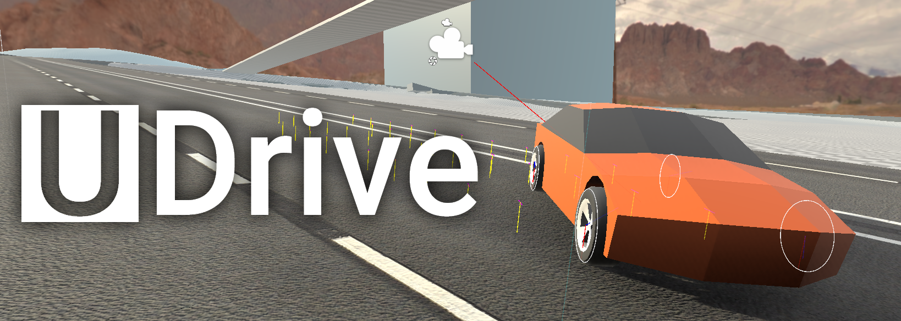

*Advanced vehicle simulation system for Unity*

# Advantages
* Configurable drivetrain simulation
  * ICE, EV and custom engine types
  * Fixed and Manual gearbox with clutch
  * Easy to extend
* Completely custom friction and suspension
* 3D wheel collision
* Procedural suspension audio
* Vehicle assists (ABS, TCS)
* Modern Unity package, doesnt litter your Assets directory
* Serialization support (demos)
* Multiple ground types

# Licensing

UDrive is released under GNU LGPL 3.0.

You are free to include UDrive in your commercial/proprietary projects but changes made to UDrive itself have to be released under LGPL.

# Contributing

Contributions are welcome, feel free to open issues and pull requests.

# Installation
Refer to the [Unity manual](https://docs.unity3d.com/Manual/upm-ui-giturl.html).

# Usage

Check out the basics in the [Wiki](https://github.com/sowa705/UDrive/wiki)
